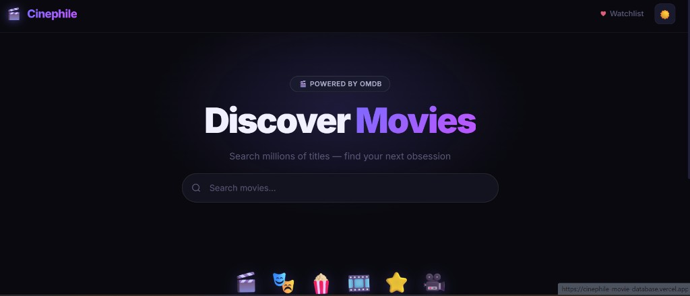
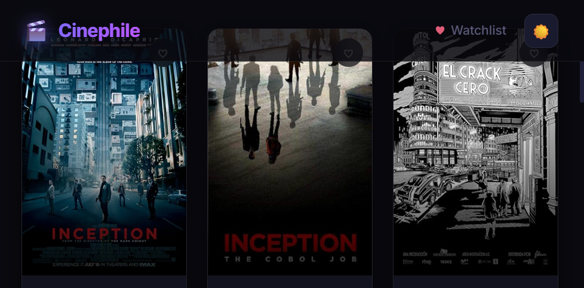
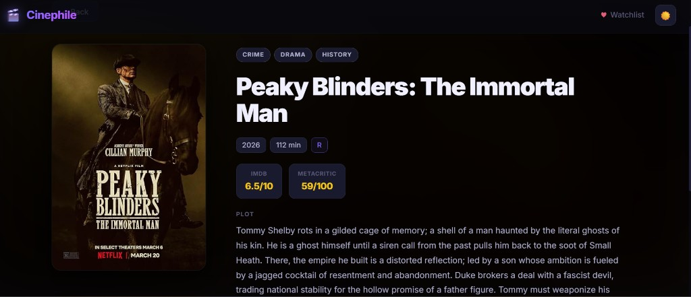
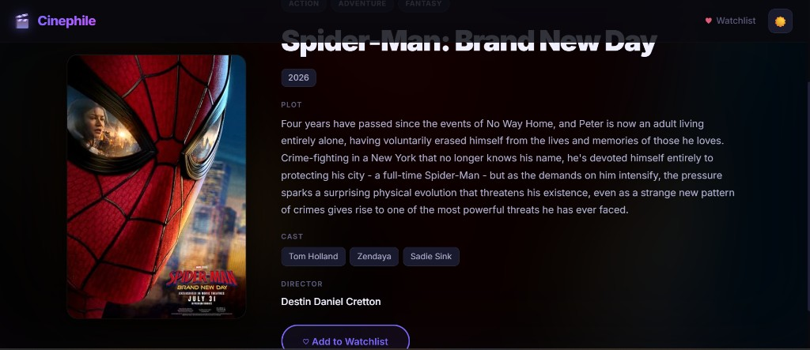
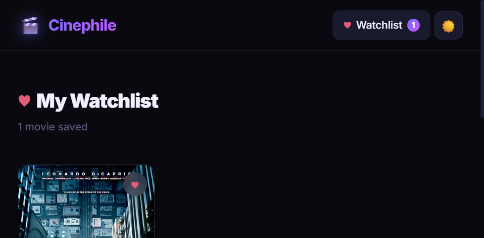

# Cinephile — Movie Database

**[Live demo](https://cinephile-movie-database.vercel.app/)** · [GitHub](https://github.com/DudiMonsonego/Cinephile-Movie-Database)

A responsive movie discovery web app where you can search the OMDb catalog, explore rich detail pages, and build a personal watchlist that persists in the browser.

Built as a **portfolio project** to demonstrate modern React patterns, API integration, and polished UI without relying on a component library.

---

## Screenshots

### Home



### Search results



### Movie details





### Watchlist



---

## Highlights

| Area | What it demonstrates |
|------|----------------------|
| **Data fetching** | Debounced search, pagination, and graceful handling of partial / empty API responses |
| **State management** | React Context for theme and watchlist, with `localStorage` persistence |
| **Routing** | Shareable URLs for every title (`/movie/:id`) via React Router |
| **UX** | Skeleton loaders, dark/light mode, sort controls, and accessible error states |
| **Styling** | CSS Modules + design tokens — no Tailwind or UI kit |

---

## Features

- **Live search** — queries the [OMDb API](https://www.omdbapi.com/) as you type (450ms debounce)
- **Movie grid** — responsive cards with poster, title, year, and IMDb rating
- **Detail pages** — plot, cast, director, ratings, and cinematic blurred backdrop
- **Watchlist** — add/remove titles; saved across sessions in `localStorage`
- **Sorting** — relevance, title (A–Z / Z–A), year, or rating
- **Dark / light mode** — toggle in the navbar; preference persisted
- **Load more** — paginated results beyond the first page
- **Loading & errors** — shimmer skeletons and clear messages when nothing matches

---

## Tech stack

- [React 19](https://react.dev/) + [Vite 8](https://vite.dev/)
- [React Router 7](https://reactrouter.com/)
- CSS Modules (component-scoped styles)
- Context API (`ThemeContext`, `WatchlistContext`)
- [OMDb API](https://www.omdbapi.com/) for movie data
- Deployed on [Vercel](https://vercel.com/)

---

## Getting started

### Prerequisites

- [Node.js](https://nodejs.org/) 18+ (LTS recommended)
- A free [OMDb API key](https://www.omdbapi.com/apikey.aspx) (1,000 requests/day on the free tier)

### 1. Clone the repository

```bash
git clone https://github.com/DudiMonsonego/Cinephile-Movie-Database.git
cd Cinephile-Movie-Database
```

### 2. Configure environment variables

Copy `.env.example` to `.env` and add your key:

```env
VITE_OMDB_API_KEY=your_api_key_here
```

> **Note:** `.env` is gitignored. Never commit API keys to version control.

### 3. Install dependencies and run

```bash
npm install
npm run dev
```

Open [http://localhost:5173](http://localhost:5173) in your browser.

### Other scripts

| Command | Description |
|---------|-------------|
| `npm run build` | Production build to `dist/` |
| `npm run preview` | Preview the production build locally |
| `npm run lint` | Run ESLint |

---

## Project structure

```
src/
├── components/
│   ├── Navbar.jsx           # Sticky nav, theme toggle, watchlist badge
│   ├── SearchBar.jsx        # Auto-focused search with clear button
│   ├── MovieCard.jsx        # Grid card + watchlist action
│   ├── SkeletonCard.jsx     # Shimmer loading placeholder
│   └── SortControls.jsx     # Sort dropdown + result count
├── context/
│   ├── ThemeContext.jsx     # Dark / light mode
│   └── WatchlistContext.jsx # Watchlist + localStorage sync
├── hooks/
│   └── useDebounce.js       # Reusable debounce hook
├── pages/
│   ├── Home.jsx             # Search, grid, pagination
│   ├── MovieDetails.jsx     # Full detail view
│   └── Watchlist.jsx        # Saved movies
├── App.jsx                  # Router and providers
└── index.css                # CSS variables and base styles
screenshots/                 # README preview images
```

---

## Deployment

The app is live at **[cinephile-movie-database.vercel.app](https://cinephile-movie-database.vercel.app/)**.

After `npm run build`, deploy the `dist/` folder to any static host (Vercel, Netlify, GitHub Pages, etc.). Set `VITE_OMDB_API_KEY` in your host’s environment variables before building.

For client-side routing on Vercel, `vercel.json` rewrites all routes to `index.html` so deep links like `/movie/tt1375666` work correctly.

---

## Author

**Dudi Monsonego** — [GitHub @DudiMonsonego](https://github.com/DudiMonsonego)

---

## License

This project is open source and available for portfolio review. Feel free to explore the code; please credit the author if you fork or reuse substantial portions.
